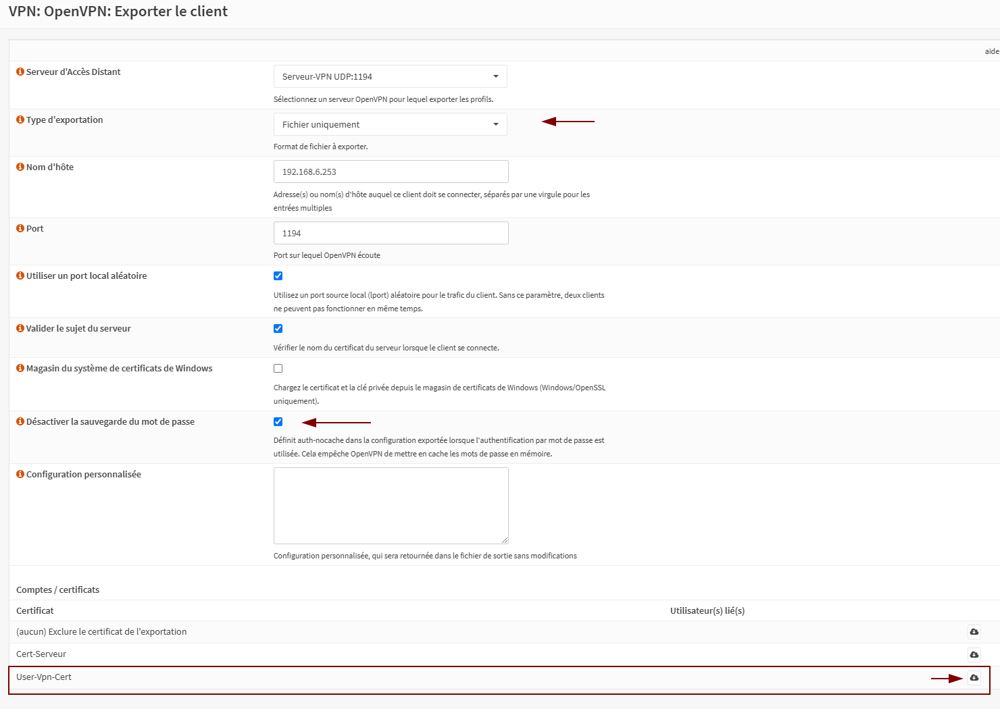

# Configuration de Base : VPN OpenVPN sur OPNsense

Ce guide explique comment configurer un serveur VPN OpenVPN de manière basique sur OPNsense. Cette configuration convient à des tests, mais elle ne doit pas être utilisée en production sans un renforcement des mesures de sécurité.

---

## Table des Matières

1. Prérequis
2. Configuration de l'interface WAN
3. Création de l'autorité de certification
4. Création du certificat serveur
5. Configuration du serveur VPN
6. Ajout d'utilisateurs
7. Configuration du pare-feu
8. Configuration du client VPN
9. Sources

---

## 1. Prérequis

- OPNsense doit être installé et accessible via l’interface web.
- La machine doit être configurée comme passerelle, physique ou virtuelle.
- Utilisez un mot de passe complexe et sécurisé pour protéger l'accès à l'interface web.

---

## 2. Configuration de l'interface WAN

1. Accédez aux paramètres de l'interface WAN via l'interface web.
2. Si vous utilisez des adresses IP privées (par exemple dans une VM), désactivez l'option suivante :
   - Bloquer les Réseaux Privés RFC1918
3. Exemple de configuration :  
   

---

## 3. Création de l'autorité de certification

1. Accédez à **Système > Gestion des Certificats > Autorité**.
2. Cliquez sur l'icône "+" pour ajouter une nouvelle autorité de certification.  
   

3. Renseignez les informations nécessaires, comme suit :
   - Utilisez un nom descriptif pour identifier clairement l'autorité.
   - Préférez un certificat RSA2048 (RSA4096 peut poser des problèmes dans certains cas).  
   

---

## 4. Création du certificat serveur

1. Allez dans **Système > Gestion des Certificats > Certificats**.
2. Cliquez sur l'icône "+" pour ajouter un certificat serveur.  
   

---

## 5. Configuration du serveur VPN

1. Allez dans **VPN > OpenVPN > Servers [legacy]**.
2. Cliquez sur l'icône "+" pour configurer un nouveau serveur VPN.  
   
   
   
Note importante : 
 - Certains paramètres de compression peuvent empêcher les clients de se connecter. Testez ces paramètres avant de finaliser.
 - Pour plus de sécurité : Accès à distance (SSL/TLS + authentification utilisateur)
---

## 6. Ajout d'utilisateurs

1. Accédez à **Système > Accès > Utilisateurs**.
2. Cliquez sur l'icône "+" pour créer un nouvel utilisateur.  
   

3. Cochez l'option "Créer un certificat utilisateur" pour générer un certificat lors de la création de l'utilisateur.
   Ceci est valable pour les version avant la 25.1.

   

   dans le cas de la version 25.1 il faut creer l'utilisateur et ensite aller dans l'onglet "Système: Gestion des Certificats: Certificats" pour creer le certificat associé à l'utilisateur.
   Attention le nom du certificat doit correspondre à celui de l'utilisateur concerné sinon l'authentification ne fonctionnera pas.

   
   
---

## 7. Configuration du pare-feu

1. Configurez les règles pour autoriser le trafic VPN :
   - Accédez à **Pare-feu > Règles > WAN** et ajoutez les règles nécessaires.  
     
   - Faites de même dans **Pare-feu > Règles > OpenVPN** pour permettre le trafic VPN.  
     

---

## 8. Configuration du client VPN

1. Allez dans **VPN > OpenVPN > Exporter le client**.  
   

2. Téléchargez et installez la dernière version d’un client OpenVPN, tel que :
   - OpenVPN GUI : https://openvpn.net/community-downloads/
   - OpenVPN Connect

3. Importez le fichier `.ovpn` dans le répertoire de configuration du client OpenVPN :
   - Chemin par défaut sous Windows : `C:\Program Files\OpenVPN\config`

4. Lancez le client VPN, saisissez vos identifiants, et vérifiez que la connexion fonctionne correctement.  
   

---

## 9. Sources

---

## Licence

Vous pouvez utiliser, modifier et redistribuer ce guide dans le respect des termes de la licence [MIT](https://opensource.org/licenses/MIT).
